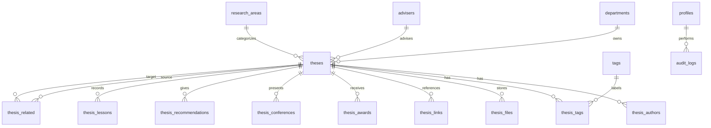

# Alexandria Database Engineer Reference

## Purpose

This reference translates Alexandria's MVP requirements into a database-facing handoff for the database engineer. The accepted MVP backend platform is Supabase: hosted PostgreSQL, Supabase Auth, and Supabase Storage.

Alexandria is a web-based thesis repository for DCISM. The MVP must let students browse, search, filter, preview, and inspect thesis records, while authorized admins manage thesis metadata and document access.

## Team Context

| Role | Responsibility |
| --- | --- |
| Project manager / backend integrator | Defines backend contracts, connects frontend flows to database queries, coordinates API and schema changes |
| Frontend developer 1 | Builds repository browsing, search, filter, and detail UI |
| Frontend developer 2 | Builds admin/upload UI, PDF preview UI, and interaction states |
| Database engineer | Designs schema, migrations, indexes, seed data, and query support for backend |

## Accepted Architecture Decisions

| Decision | Choice | Impact |
| --- | --- | --- |
| Database engine | Supabase/PostgreSQL | Use Postgres tables, foreign keys, migrations, indexes, and Row Level Security policies |
| File storage | Supabase Storage/object storage | Store PDFs in a storage bucket and save object keys/metadata in `thesis_files` |
| File storage fallback | External PDF/repository links only if storage is blocked | Keep `thesis_links` and `repository_url` available as fallback paths |
| Authentication | Supabase Auth | Use `auth.users` for identity and a public `profiles` table for app roles/display metadata |
| Related theses | Dynamic shared tags/research area | Compute related theses at query time; skip `thesis_related` for initial MVP unless manual overrides are later required |
| PDF access | Authenticated preview and download | Use private/authenticated storage access for thesis PDFs |
| Admin workflow | Draft then publish | New admin-created thesis records start as `draft` and are manually published |
| Metadata entry | Upload PDF and manually enter metadata | Admin flow should attach a PDF and require manual metadata entry before publish |
| Author handling | Names only | Store ordered author names on each thesis; do not collect author email/contact in MVP |
| Recommendations and lessons | Multiple ordered entries | Store each recommendation/lesson as its own ordered row |
| Account creation | School-email student self-registration | Student visitor accounts may self-register with `usc.edu.ph` email addresses |
| Metadata visibility | Full published metadata is public | Anonymous users can inspect thesis metadata but cannot access PDFs |
| Delete behavior | Archive/unpublish plus internal soft delete | Normal admin UI avoids hard delete while preserving recoverability |
| User roles | Admin, Contributor, Student visitor | Store app roles in `profiles.role` |
| Thesis statuses | `draft`, `published`, `archived` | Use status to control public visibility and admin workflows |
| PDF replacement | Retain old file metadata | Mark the current file as primary and keep old metadata for history |
| Search behavior | Search plus filters plus sort | Repository queries should support all three discovery modes |
| Default sort | Newest thesis year first | Use year-descending ordering by default |
| Classification | Controlled research areas plus flexible tags | Keep research areas curated and tags expressive |

## MVP Data Requirements

Each thesis record must support:

| Field | Required | Notes |
| --- | --- | --- |
| Title | Yes | Main searchable title |
| Authors | Yes | Multiple authors per thesis |
| Year | Yes | Used for display and filtering |
| Adviser | Yes | Used for filtering |
| Department | Yes | MVP default is DCISM, but keep normalized for future expansion |
| Abstract | Yes | Full detail page text; preview derived by backend/frontend |
| Keywords / tags | Yes | Used for search, filtering, and related thesis matching |
| PDF file or repository link | Yes | Store one or both depending on policy |
| Awards | No | Optional recognitions |
| Conference presentations | No | Optional presentation/publication info |
| Recommendations for future researchers | Yes | Knowledge-transfer feature |
| Lessons learned | Yes | Knowledge-transfer feature |
| Related theses | Yes | Derived by shared tags/categories for MVP |

Recommendations and lessons are distinct:

- Recommendations describe study gaps, research opportunities, limitations, and future work for later researchers.
- Lessons learned describe practical execution guidance, development challenges, process advice, tooling issues, team workflow advice, defense preparation, and implementation pitfalls.

## Suggested Conceptual Model

## Recommended Tables

### `departments`

Stores departments so Alexandria can start with DCISM but avoid hardcoding it everywhere.

| Column | Notes |
| --- | --- |
| id | Primary key |
| name | Unique department name, e.g. `Department of Computer Information Science and Mathematics` |
| code | Unique short code, e.g. `DCISM` |
| created_at, updated_at | Standard timestamps |

### `advisers`

Stores faculty advisers used by thesis records and filters.

| Column | Notes |
| --- | --- |
| id | Primary key |
| full_name | Required |
| email | Optional, unique if collected |
| department_id | Foreign key to `departments` |
| created_at, updated_at | Standard timestamps |

### `research_areas`

Stores broad categories used by filters and related thesis discovery.

| Column | Notes |
| --- | --- |
| id | Primary key |
| name | Unique category name, e.g. `Web Development`, `Machine Learning`, `Information Systems` |
| created_at, updated_at | Standard timestamps |

### `tags`

Stores keywords/tags used for search and related thesis discovery.

| Column | Notes |
| --- | --- |
| id | Primary key |
| name | Unique normalized tag name |
| created_at, updated_at | Standard timestamps |

### `theses`

Core thesis record.

| Column | Notes |
| --- | --- |
| id | Primary key |
| title | Required; searchable |
| slug | Unique URL-safe identifier if frontend needs readable routes |
| abstract | Required |
| year | Required; indexed for filtering |
| department_id | Foreign key to `departments` |
| adviser_id | Foreign key to `advisers` |
| research_area_id | Foreign key to `research_areas`; nullable if the team only uses tags |
| repository_url | Optional external repository link |
| publication_status | Required status: `draft`, `published`, or `archived` |
| created_by_user_id | Foreign key to `profiles.id`; maps back to Supabase `auth.users.id` |
| created_at, updated_at, deleted_at | Standard timestamps; `deleted_at` supports soft delete |

### `thesis_authors`

Stores ordered author names for each thesis. MVP does not require reusable author profiles or contact fields.

| Column | Notes |
| --- | --- |
| thesis_id | Foreign key to `theses` |
| author_name | Required display/search name |
| author_order | Keeps display order stable |

Suggested constraint: unique pair on `thesis_id` + `author_order`.

### `thesis_tags`

Many-to-many link between theses and tags.

| Column | Notes |
| --- | --- |
| thesis_id | Foreign key to `theses` |
| tag_id | Foreign key to `tags` |

Suggested constraint: unique pair on `thesis_id` + `tag_id`.

### `thesis_files`

Stores metadata for uploaded PDFs or document files. The actual file should live in Supabase Storage; this table stores the database-side pointer and display metadata.

| Column | Notes |
| --- | --- |
| id | Primary key |
| thesis_id | Foreign key to `theses` |
| file_name | Original or sanitized file name |
| bucket_name | Supabase Storage bucket name, e.g. `thesis-pdfs` |
| storage_key | Supabase Storage object path/key |
| mime_type | Example: `application/pdf` |
| file_size_bytes | Useful for preview/download UI |
| checksum | Optional integrity check |
| is_primary | Marks the main PDF |
| replaced_by_file_id | Optional self-reference when a file is replaced |
| visibility | Default `authenticated`; MVP requires authenticated preview and download |
| created_at, updated_at | Standard timestamps |

### `thesis_links`

Stores external links separately when a thesis may have multiple resources.

| Column | Notes |
| --- | --- |
| id | Primary key |
| thesis_id | Foreign key to `theses` |
| label | Example: `GitHub Repository`, `Demo`, `Publication` |
| url | Required |
| created_at, updated_at | Standard timestamps |

### `thesis_awards`

Optional awards/recognition records.

| Column | Notes |
| --- | --- |
| id | Primary key |
| thesis_id | Foreign key to `theses` |
| title | Award name |
| awarded_by | Optional awarding body |
| year | Optional |
| created_at, updated_at | Standard timestamps |

### `thesis_conferences`

Optional conference presentation records.

| Column | Notes |
| --- | --- |
| id | Primary key |
| thesis_id | Foreign key to `theses` |
| conference_name | Required |
| presentation_title | Optional if same as thesis title |
| presentation_date | Optional |
| location | Optional |
| created_at, updated_at | Standard timestamps |

### `thesis_recommendations`

Stores recommendations for future researchers. Separate table allows multiple recommendations and easier editing.

| Column | Notes |
| --- | --- |
| id | Primary key |
| thesis_id | Foreign key to `theses` |
| content | Required |
| sort_order | Optional display order |
| created_at, updated_at | Standard timestamps |

### `thesis_lessons`

Stores lessons learned. Separate table allows multiple lessons and easier editing.

| Column | Notes |
| --- | --- |
| id | Primary key |
| thesis_id | Foreign key to `theses` |
| content | Required |
| sort_order | Optional display order |
| created_at, updated_at | Standard timestamps |

### `thesis_related`

Optional materialized related-thesis links. For the accepted MVP, related theses should be computed dynamically from shared tags and/or research area, so this table can be skipped at first.

| Column | Notes |
| --- | --- |
| source_thesis_id | Foreign key to `theses` |
| target_thesis_id | Foreign key to `theses` |
| reason | Example: `shared_tags`, `same_research_area`, `manual` |
| score | Optional numeric similarity score |
| created_at | Standard timestamp |

Suggested constraint: unique pair on `source_thesis_id` + `target_thesis_id`.

### `profiles`

Application profile table linked to Supabase Auth. Supabase owns identity in `auth.users`; Alexandria stores app-specific role/display data here.

| Column | Notes |
| --- | --- |
| id | Primary key; foreign key to `auth.users.id` |
| full_name | Required |
| email | Unique |
| role | Suggested values: `admin`, `contributor`, `student_visitor` |
| created_at, updated_at, deleted_at | Standard timestamps |

### `audit_logs`

Useful for admin changes to thesis records.

| Column | Notes |
| --- | --- |
| id | Primary key |
| user_id | Foreign key to `profiles.id`, nullable for system actions |
| action | Example: `thesis.created`, `thesis.updated`, `file.uploaded` |
| entity_type | Example: `thesis`, `file`, `tag` |
| entity_id | ID of affected record |
| metadata | Optional JSON/text details |
| created_at | Standard timestamp |

## Query Patterns To Support

The backend will likely need these database queries:

| Backend need | Query support |
| --- | --- |
| Repository page | List published theses with title, ordered author names, year, abstract preview, tags |
| Search | Match title, author names, tags, abstract keywords |
| Filters | Filter by year, adviser, department, research area |
| Detail page | Fetch thesis metadata, authors, tags, files, links, recommendations, lessons, related theses |
| Admin list | Paginated thesis list with status and last updated date |
| Admin editor | Create/update thesis and nested authors, tags, files, recommendations, lessons |
| Related theses | Find theses sharing tags or research area, excluding the current thesis |
| Default repository browse | Return published theses ordered by newest thesis year first |

## Supabase Access Model

Use Supabase Row Level Security for database authorization.

| Data area | Public/anonymous users | Authenticated privileged users |
| --- | --- | --- |
| Published theses | Read full published metadata | Admins/Contributors read all records based on role |
| Draft/archived theses | No access | Admins/Contributors read/write based on role |
| Thesis metadata tables | Read records connected to published theses | Admins/Contributors create/update/archive based on role |
| Profiles | No public profile browsing required | Users update own profile; admins manage Contributor roles |
| Storage objects | No anonymous PDF access | Student visitors preview/download published PDFs; Admins/Contributors upload, replace, and manage PDFs |
| Audit logs | No access | Insert automatically; read by admins if needed |

Recommended policy direction:

- Enable RLS on all public application tables.
- Keep Supabase `auth.users` as the identity source.
- Store app roles in `profiles.role`: `admin`, `contributor`, `student_visitor`.
- Restrict student self-registration to `usc.edu.ph` email addresses.
- Use a private or authenticated `thesis-pdfs` bucket for MVP.
- Use signed URLs or authenticated storage reads for PDF preview and download.

## Suggested Indexes

Exact syntax should target PostgreSQL/Supabase.

| Table | Columns | Purpose |
| --- | --- | --- |
| theses | title | Search by title |
| theses | year | Year filtering |
| theses | adviser_id | Adviser filtering and joins |
| theses | department_id | Department filtering and joins |
| theses | research_area_id | Research area filtering and joins |
| theses | publication_status | Published/admin list filtering |
| theses | year, publication_status | Default public browse by newest published thesis year |
| thesis_authors | thesis_id, author_order | Display ordering and uniqueness |
| thesis_tags | thesis_id, tag_id | Joins and uniqueness |
| tags | name | Tag lookup and uniqueness |
| thesis_authors | author_name | Author search |
| thesis_files | thesis_id, is_primary | Main PDF lookup |

Consider PostgreSQL full-text search across `theses.title`, `theses.abstract`, `thesis_authors.author_name`, and `tags.name`. For the MVP, a simpler `ILIKE` search may be acceptable first, then upgrade to `tsvector`/GIN indexes if search feels slow or weak.

## Backend Contract Notes

Use these as the early API/database boundary:

| API intent | Database responsibility |
| --- | --- |
| `GET /theses` | Return paginated thesis cards with filters and search |
| `GET /theses/:id` or `GET /theses/:slug` | Return full detail page payload |
| `POST /admin/theses` | Create a draft thesis plus related metadata transactionally |
| `PATCH /admin/theses/:id` | Update thesis plus nested metadata safely |
| `POST /admin/theses/:id/files` | Upload to Supabase Storage, then store file metadata after storage succeeds |
| `POST /admin/theses/:id/files/replace` | Store replacement metadata, keep old file metadata, and mark the newest valid PDF as primary |
| `POST /admin/theses/:id/publish` | Validate required metadata/file presence, then move status from `draft` to `published` |
| `POST /admin/theses/:id/archive` | Move published or draft record to `archived` and remove it from public results |
| `DELETE /admin/theses/:id` | Internal soft delete only; not a normal admin UI action |

## Seed Data Needed

Minimum seed data for frontend/backend integration:

| Data | Minimum count |
| --- | --- |
| Departments | 1: DCISM |
| Advisers | 3 to 5 |
| Research areas | 5 to 8 |
| Tags | 15 to 25 |
| Published thesis records | 8 to 12 |
| Draft thesis records | 2 |
| Archived thesis records | 1 |
| Admin profiles/Auth users | 1 |
| Contributor profiles/Auth users | 1 |
| Student visitor profiles/Auth users | 2 |

## Resolved Decisions

1. Database engine:
   - Accepted: Supabase/PostgreSQL.

2. File storage:
   - Accepted: Supabase Storage/object storage, with links-only as fallback if storage becomes impractical.

3. Authentication:
   - Accepted: Supabase Auth.

4. Related thesis logic:
   - Accepted: Compute dynamically from shared tags and/or research area.

5. Account creation:
   - Accepted: Student visitors may self-register with `usc.edu.ph` email addresses.

6. Metadata visibility:
   - Accepted: Full published thesis metadata is public; PDF access requires authentication.

7. Delete behavior:
   - Accepted: Archive/unpublish through the admin UI, with internal soft delete support.

8. Roles:
   - Accepted: Admin, Contributor, Student visitor.

9. Thesis statuses:
   - Accepted: `draft`, `published`, `archived`.

10. Search and classification:
   - Accepted: Search plus filters plus sort, newest thesis year first by default, controlled research areas plus flexible tags.

## Resolved Feature Decisions

These choices affect schema, storage policy, and backend API behavior.

1. PDF access policy:
   - Accepted: Both preview and download authenticated.

2. Admin workflow:
   - Accepted: Admin-created records start as draft, then manually publish.

3. Metadata source of truth:
   - Accepted: Admin uploads PDF and manually enters required metadata.

4. Author handling:
   - Accepted: Store author names only.

5. Recommendations and lessons learned:
   - Accepted: Multiple ordered bullet-style entries.

## Recommended First Task For DB Engineer

Create an initial ERD and migration draft for:

- `departments`
- `advisers`
- `research_areas`
- `tags`
- `theses`
- `thesis_authors`
- `thesis_tags`
- `thesis_files`
- `thesis_recommendations`
- `thesis_lessons`
- `profiles`

Then review it with the backend integrator before adding optional awards, conferences, audit logs, and related-thesis materialization.
